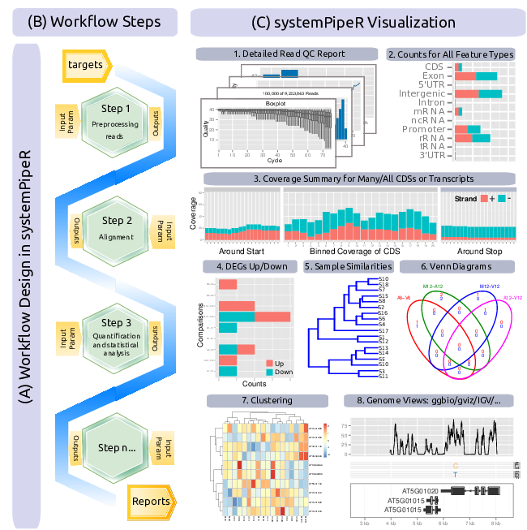

```{css, echo=FALSE}
pre code {
white-space: pre !important;
overflow-x: scroll !important;
word-break: keep-all !important;
word-wrap: initial !important;
}
```

<!--
- Compile from command-line
Rscript -e "rmarkdown::render('systemPipeR.Rmd', c('BiocStyle::html_document'), clean=F); knitr::knit('systemPipeR.Rmd', tangle=TRUE)"; Rscript ../md2jekyll.R systemPipeR.knit.md 2; Rscript -e "rmarkdown::render('systemPipeR.Rmd', c('BiocStyle::pdf_document'))"
-->

```{r style, echo = FALSE, results = 'asis'}
BiocStyle::markdown()
options(width=60, max.print=1000)
knitr::opts_chunk$set(
    eval=as.logical(Sys.getenv("KNITR_EVAL", "TRUE")),
    cache=as.logical(Sys.getenv("KNITR_CACHE", "TRUE")), 
    tidy.opts=list(width.cutoff=60), tidy=TRUE)
```

```{r setup, echo=FALSE, messages=FALSE, warnings=FALSE}
suppressPackageStartupMessages({
    library(systemPipeR)
    library(BiocParallel)
    library(Biostrings)
    library(Rsamtools)
    library(GenomicRanges)
    library(ggplot2)
    library(GenomicAlignments)
    library(ShortRead)
    library(ape)
    library(batchtools)
})
```

**Note:** if you use _`systemPipeR`_ in published research, please cite:
Backman, T.W.H and Girke, T. (2016). *systemPipeR*: NGS Workflow and Report Generation Environment. *BMC Bioinformatics*, 17: 388. [10.1186/s12859-016-1241-0](https://doi.org/10.1186/s12859-016-1241-0).

## *systemPipeR*

### Overview

*systemPipeR* provides utilities for building and running automated end-to-end
analysis workflows for a wide range of research applications, including next
generation sequence (NGS) experiments [@H_Backman2016-bt]. Important features include
a uniform workflow interface across different data analysis applications,
automated report generation, and support for running both R and command-line
software, such as NGS aligners or peak/variant callers, on local computers or
compute clusters (Fig. 1). The latter supports interactive job submissions and batch
submissions to queuing systems of clusters. The main motivation and advantages
of using *sytemPipeR* for complex data analysis tasks are:

1. Facilitates design of complex NGS workflows involving multiple R/Bioconductor packages
2. Common workflow interface for different NGS applications
3. Makes NGS analysis with Bioconductor utilities more accessible to new users
4. Simplifies usage of command-line software from within R
5. Reduces complexity of using compute clusters for R and command-line software
6. Accelerates runtime of workflows via parallelzation 
7. Improves reproducibility by automating analyses and generation of analysis reports 



**Figure 1:** Relevant features in *systemPipeR*.
Workflow design concepts are illustrated under (A & B). Examples of
*systemPipeR’s* visualization functionalities are given under (C). </br>

This tutorial introduces how to use *systemPipeR's* new CWL (Common Workflow
Language) interface to run data analysis workflows composed of both R and
command-line analysis routines. In previous versions, *systemPipeR* used a
custom command-line interface for this purpose which will continue to be
supported for some time. With the latest Bioconductor Release 3.9, we are
adopting for this functionality the widely used community standard CWL for
describing analysis workflows in a generic and reproducible manner. Using this
community standard in *systemPipeR* has many advantages. For instance, the
integration of CWL allows to run *systemPipeR* workflows from a single
specification instance either entirely from within R, from various command-line
wrappers (e.g.  *cwl-runner*) or from other languages (*e.g.* Bash or Python).
This includes support for both command-line and R/Bioconductor software as well
as resources for containerization, parallel evaluations on computer clusters
along with automated generation of interactive analysis reports. 

An important feature of *systemPipeR's* CWL interface is that it provides two
options to run command-line tools and workflows based on CWL. First, one can
run CWL in its native way via an R-based wrapper utility for *cwl-runner* or
*cwl-tools* (CWL-based approach). Second, one can run workflows using CWL's
command-line and workflow instructions from within R (R-based approach). In the
latter case the same CWL workflow definition files (*e.g.* `*.cwl` and `*.yml`)
are used but rendered and exectuted entirely with R functions defined by
*systemPipeR*, and thus use CWL mainly as a command-line and workflow
definition format rather than a software to run workflows. In this regard
*systemPipeR* also provides several convenience functions that are useful for
designing and debugging workflows, such as a command-line rendering function to
retrieve the exact command-line strings for each data set and processing step
prior to running a command-line.

This overview also introduces the design of a new CWL S4 class in *systemPipeR*
combined with examples of the basic usage of CWL from both within R and the
command-line, as well as the construction of custom workflows. A short use-case
demonstration will guide users through basic steps of an RNA-Seq profiling
workflow that will include read mappings with variable parameter settings of
popular short-read aligners (*e.g.* HISAT2 or STAR), read quantification and
statistical analyses steps as well as automation routines for running NGS
workflows from start to finish with a single command. The last part will
demonstrate how to parallelize the analysis of a relatively large NGS data sets
on multiple CPU cores of single machines as well as computer clusters with a
scheduler (*e.g.* Slurm). 

# Getting Started

## Installation

The *`systemPipeR`* package can be installed from the R console using the
[*`BiocManager::install`*](https://cran.r-project.org/web/packages/BiocManager/index.html)
command. The associated data package
[*`systemPipeRdata`*](https://github.com/tgirke/systemPipeRdata) can be
installed the same way. The latter is a helper package for generating
*`systemPipeR`* workflow environments with a single command containing all
parameter files and sample data required to quickly test and run sample workflows. 

```{r install2, eval=FALSE}
if(!requireNamespace("BiocManager", quietly=TRUE)) 
    install.packages("BiocManager")
BiocManager::install("systemPipeR")
BiocManager::install("systemPipeRdata")
```

## Load Package

```{r documentation, eval=TRUE}
library("systemPipeR") # Loads the package
# library(help="systemPipeR") # Lists package info
# vignette("systemPipeR") # Opens vignette
```

# Run Environment

## Load Sample Workflow

Sample workflows can be loaded with the `genWorkenvir` function from
`systemPipeRdata`. The following commands load an RNA-Seq workflow that
includes 36 FASTQ files from SRA entry
[`SRP010938`](http://www.ncbi.nlm.nih.gov/sra/?term=SRP010938) corresponding to
18 paired-end (PE) read sets from *Arabidposis thaliana* [@Howard2013-fq].  To
minimize processing time during testing, each of the 36 FASTQ files has been
subsetted to 90,000-100,000 randomly sampled PE reads that map to the first
100,000 nucleotides of each chromosome in the *A. thalina* genome. The
corresponding reference genome sequence (FASTA) and its GFF annotion file have
been truncated accordingly, and are included in the workflow as well. After
these truncations, the entire test data set requires less than 200MB disk
space. A PE read set has been chosen here for flexibility, because it can be
used for testing both types of analysis routines requiring either SE (single
end) or PE reads. 

```{r genRna_workflow, eval=TRUE, results='hide'}
library(systemPipeRdata)
genWorkenvir(workflow="rnaseq")
setwd("rnaseq")
```

```{r setup_folder, include=FALSE, echo=FALSE}
knitr::opts_knit$set(root.dir = "./rnaseq/")
```


## Directory Structure

The working environment of the sample data loaded in the previous step contains
the following preconfigured directory structure (Fig. 2). Directory names are indicated
in  <span style="color:grey">***green***</span>. Users can change this
structure as needed, but need to adjust the code in their workflows
accordingly. 

* <span style="color:green">_**workflow/**_</span> (*e.g.* *rnaseq/*) 
    + This is the root directory of the R session running the workflow.
    + Run script ( *\*.Rmd*) and sample annotation (*targets.txt*) files are located here.
    + Note, this directory can have any name (*e.g.* <span style="color:green">_**rnaseq**_</span>, <span style="color:green">_**varseq**_</span>). Changing its name does not require any modifications in the run script(s).
  + **Important subdirectories**: 
    + <span style="color:green">_**param/**_</span> 
        + Stores non-CWL parameter files such as: *\*.param*, *\*.tmpl* and *\*.run.sh*. These files are only required for backwards compatibility to run old workflows using the previous custom command-line interface.
        + <span style="color:green">_**param/cwl/**_</span>: This subdirectory stores all the CWL parameter files. To organize workflows, each can have its own subdirectory, where all `CWL param` and `input.yml` files need to be in the same subdirectory. 
    + <span style="color:green">_**data/**_ </span>
        + FASTQ files
        + FASTA file of reference (*e.g.* reference genome)
        + Annotation files
        + etc.
    + <span style="color:green">_**results/**_</span>
        + Analysis results are usually written to this directory, including: alignment, variant and peak files (BAM, VCF, BED); tabular result files; and image/plot files
        + Note, the user has the option to organize results files for a given sample and analysis step in a separate subdirectory.


**Figure 2:** *systemPipeR's* preconfigured directory structure.

The following parameter files are included in each workflow template:

1. *`targets.txt`*: initial one provided by user; downstream *`targets_*.txt`* files are generated automatically
2. *`*.param/cwl`*: defines parameter for input/output file operations, *e.g.*:
    + *`hisat2-se/hisat2-mapping-se.cwl`* 
    + *`hisat2-se/hisat2-mapping-se.yml`*
3. *`*_run.sh`*: optional bash scripts 
4. Configuration files for computer cluster environments (skip on single machines):
    + *`.batchtools.conf.R`*: defines the type of scheduler for *`batchtools`* pointing to template file of cluster, and located in user's home directory
    + *`*.tmpl`*: specifies parameters of scheduler used by a system, *e.g.* Torque, SGE, Slurm, etc.

## Workflow Design

*systemPipeR* workflows can be run from start-to-finish with a single command
or stepwise in interactive mode from the R console. The connectivity among
workflow steps is achieved by the *`SYSargs2`* workflow control class (see Fig.
3). This S4 class is a list-like container where each instance stores all the
input/output paths and parameter components requried for a particular data
analysis step. *`SYSargs2`* instances are generated by two constructor
functions, *loadWorkflow* and *renderWF*, using as data input *targets* or
*yaml* files as well as two *cwl* parameter files (for details see below). When
running preconfigured workflows, the only input the user needs to provide is
the initial *targets* file containing the paths to the input files (*e.g.*
FASTQ) along with unique sample labels. Subsequent targets instances are
created automatically. The parameters required for running command-line
software are provided by the parameter (*.cwl*) files described below. 

We also introduce the *`SYSargs2Pipe`* class that organizes one or many
SYSargs2 containers in a single compound object capturing all information
required to run, control and monitor complex workflows from start to finish. This
design enhances the *`systemPipeR`* workflow framework with a generalized,
flexible, and robust design.


**Figure 3:** Workflow steps with input/output file operations are controlled by 
*`SYSargs2`* objects. Each *`SYSargs2`* instance is constructed from one *targets* 
and two *param* files. The only input provided by the user is the initial *targets* 
file. Subsequent *targets* instances are created automatically, from the previous 
output files. Any number of predefined or custom workflow steps are supported. One
or many *`SYSargs2`* objects are organized in a *`SYSargs2Pipe`* container.

# Usage of *`SYSargs2`* 

## Sample Inputs: *`targets`* file

The *`targets`* file defines all input files (*e.g.* FASTQ, BAM, BCF) and if
necessary sample comparisons of an analysis workflow. The following shows the
format of a sample *`targets`* file included in the package. It also can be
viewed and downloaded from *`systemPipeR`*'s GitHub repository
[here](https://github.com/tgirke/systemPipeR/blob/master/inst/extdata/targets.txt).
In a target file with a single type of input files, here FASTQ files of single
end (SE) reads, the first three columns are mandatory including their column
names, while it is four mandatory columns for FASTQ files of PE reads. All
subsequent columns are optional and any number of additional columns can be
added as needed. 

Users should note here, the usage of targets files is optional when using
*systemPipeR's* new CWL interface. They can be replaced by a standard YAML
input file used by CWL. Since for organizing experimental variables targets
files are extremely useful and user-friendly. Thus, we encourage users to keep using 
them. 

```{r targetsSE, eval=TRUE}
library(systemPipeR)
targetspath <- system.file("extdata", "targets.txt", package="systemPipeR") 
read.delim(targetspath, comment.char = "#")[1:4,1:4]
```

To work with custom data, users need to generate a *`targets`* file containing
the paths to their own FASTQ files and then provide under *`targetspath`* the
path to the corresponding *`targets`* file. For paired-end (PE) samples, the 
structure of the targets file is similar, where users need to provide two FASTQ 
path columns: *`FileName1`* and *`FileName2`* with the paths to the PE FASTQ 
files. 

If needed sample comparisons can be defined in the header lines of the *`targets`* 
file starting with '``# <CMP>``'. 

```{r comment_lines, echo=TRUE}
readLines(targetspath)[1:4]
```

The function *`readComp`* imports the comparison information and stores it in a
*`list`*. Alternatively, *`readComp`* can obtain the comparison information
from the corresponding *`SYSargs2`* object (see below).  Note, these header
lines are optional. They are mainly useful for controlling comparative analyses
according to certain biological expectations, such as identifying
differentially expressed genes in RNA-Seq experiments based on simple pair-wise
comparisons.
 
```{r targetscomp, eval=TRUE}
readComp(file=targetspath, format="vector", delim="-")
```

## Construct *`SYSargs2`*

*`SYSargs2`* stores all the information and instructions needed for processing
a set of input files with a single or many command-line steps within a workflow
(*i.e.* several components of a software or several independent software tools).
The *`SYSargs2`* object is created and fully populated with the *loadWorkflow* 
and *renderWF* functions, respectively. 

In CWL, files with the extension *`.cwl`* define the parameters of a chosen 
command-line step or workflow, while files with the extension *`.yml`* define 
the input variables of command-line steps. Note, input variables provided
by a *targets* file can be passed on to a *`SYSargs2`* instance via the *inputvars* 
argument of the *renderWF* function. 

```{r CWL_structure, eval=TRUE}
hisat2.cwl <- system.file("extdata", "cwl/hisat2-se/hisat2-mapping-se.cwl", package="systemPipeR")
yaml::read_yaml(hisat2.cwl)
```

```{r yaml_structure, eval=TRUE}
hisat2.yml <- system.file("extdata", "cwl/hisat2-se/hisat2-mapping-se.yml", package="systemPipeR")
yaml::read_yaml(hisat2.yml)
```

The following imports a *`.cwl`* file (here *`hisat2-mapping-se.cwl`*) for running
the short read aligner HISAT2 [@Kim2015-ve]. The *loadWorkflow* and *renderWF* 
functions render the proper command-line strings for each sample and software tool.

```{r SYSargs2_structure, eval=TRUE}
library(systemPipeR)
targets <- system.file("extdata", "targets.txt", package="systemPipeR")
dir_path <- system.file("extdata/cwl/hisat2-se", package="systemPipeR")
WF <- loadWorkflow(targets=targets, wf_file="hisat2-mapping-se.cwl",
                   input_file="hisat2-mapping-se.yml",
                   dir_path=dir_path)

WF <- renderWF(WF, inputvars=c(FileName="_FASTQ_PATH_", SampleName="_SampleName_"))
```

Several accessor methods are available that are named after the slot names of the *`SYSargs2`* object. 

```{r names_WF, eval=TRUE}
names(WF)
```

Of particular interest is the *`cmdlist()`* method. It constructs the system
commands for running command-line software as specified by a given *`.cwl`*
file combined with the paths to the input samples (*e.g.* FASTQ files) provided
by a *`targets`* file. The example below shows the *`cmdlist()`* output for
running HISAT2 on the first SE read sample. Evaluating the output of
*`cmdlist()`* can be very helpful for designing and debugging *`.cwl`* files
of new command-line software or changing the parameter settings of existing
ones.  

```{r cmdlist, eval=TRUE}
cmdlist(WF)[1]
modules(WF)
targets(WF)[1]
targets.as.df(targets(WF))[1:4,1:4]
output(WF)[1]
cwlfiles(WF)
inputvars(WF)
infile1(WF)[1:2]
```

The output components of *`SYSargs2`* define the expected output files for 
each step in the workflow; some of which are the input for the next workflow step, 
here next *`SYSargs2`* instance (see Fig. 3).

```{r output_WF, eval=TRUE}
output(WF)[1]
```

In an 'R-centric' rather than a 'CWL-centric' workflow design the connectivity
among workflow steps is established by writing all relevant output with the
*writeTargetsout* function to a new targets file that serves as input to the
next *loadWorkflow* and *renderWF* call. By chaining several *`SYSargs2`* steps
together one can construct complex workflows involving many sample-level
input/output file operations with any combination of command-line or R-based
software. Alternatively, a CWL-centric workflow design can be used that defines
all/most workflow steps with CWL workflow and parameter files. Due to time and
space restrictions the CWL-centric approach is not covered by this tutorial. 

# Workflow Demonstration

The following steps will demonstrate how to use the short read aligner HISAT2
[@Kim2015-ve] in both interactive job submissions and batch submissions to
queuing systems of clusters.  Analysis of differentially expressed genes (DEGs)
will also be performed. Subsequently, it will be demonstrated how to execute
the entire workflow with one command, while rendering at the same time the
corresponding analysis report.

## Alignment with `HISAT2`

The NGS reads of this project will be aligned against the reference genome using 
`Hisat2` [@Kim2015-ve]. The parameter settings of the aligner are 
defined in the `workflow_hisat2-se.cwl` and `workflow_hisat2-se.yml` files. 
The following shows how to construct the corresponding *SYSargs2* object, here 
*align*.

```{r hisat_alignment2, eval=TRUE}
targets <- system.file("extdata", "targets.txt", package="systemPipeR")
dir_path <- system.file("extdata/cwl/hisat2-se", package="systemPipeR")
align <- loadWorkflow(targets=targets, wf_file="hisat2-mapping-se.cwl",
                   input_file="hisat2-mapping-se.yml",
                   dir_path=dir_path)
align <- renderWF(align, inputvars=c(FileName="_FASTQ_PATH_", SampleName="_SampleName_"))
align
```

Subsetting *`SYSargs2`* class slots for each workflow step.

```{r subset, eval=TRUE}
subsetWF(align, slot="input", subset='FileName')[1:2]
subsetWF(align, slot="output", subset=1)[1:2]
subsetWF(align, slot="step", subset=1)[1] ## subset all the HISAT2 commandline 
subsetWF(align, slot="output", subset=1, delete=TRUE)[1] ##DELETE
```

### Interactive Job Submissions in a Single Machine

To simplify the short read alignment execution for the user, the command-line 
can be run with the *`runCommandline`* function.
The execution will be on a single machine without submitting to a queuing system 
of a computer cluster. This way, the input FASTQ files will be processed sequentially. 
By default *`runCommandline`* auto detects SAM file outputs and converts them 
to sorted and indexed BAM files, using internally the `Rsamtools` package 
[@Rsamtools]. Besides, *`runCommandline`* allows the user to create a dedicated
results folder for each step in the workflow and a sub-folder for each sample 
defined in the *targets* file. This includes the output and log files for each 
step.

```{r runCommandline_WF, eval=FALSE}
cmdlist(align)[1:2]
system("hisat2-build ./data/tair10.fasta ./data/tair10.fasta")
runCommandline(align, make_bam = FALSE) ## generates alignments and writes *.sam files to ./results folder 
runCommandline(align, dir=TRUE, make_bam = TRUE) ## same as above but writes files to ./results/workflowName/Samplename folders and converts *.sam files to sorted and indexed BAM files
```

Check and update the output location if necessary.

```{r output, eval=FALSE}
align <- output_update(align, dir=TRUE, replace = ".bam") ## Updates the output(align) to the right location in the subfolders
output(align)
```

Check whether all BAM files have been created with the constructing superclass *`SYSargs2Pipe`*.

```{r WF_track, eval=FALSE}
WF_track <- run_track(WF_ls = c(align))
names(WF_track)
WF_steps(WF_track)
track(WF_track)
summaryWF(WF_track)
```

### Parallelization on Clusters

The short read alignment steps can be parallelized on a 
computer cluster that uses a queueing/scheduling system such as Slurm. For this 
the *`clusterRun`*  function submits the computing requests to the scheduler 
using the run specifications defined by *`runCommandline`*. 

```{r clusterRun, eval=FALSE}
library(batchtools)
resources <- list(walltime=120, ntasks=1, ncpus=4, memory=1024)
reg <- clusterRun(align, FUN = runCommandline, more.args = list(dir=TRUE), 
                  conffile = ".batchtools.conf.R", template = "batchtools.slurm.tmpl", 
                  Njobs=18, runid="01", resourceList=resources)
getStatus(reg=reg)

align <- output_update(align, dir=TRUE, replace = ".bam") ## Updates the output(align) to the right location in the subfolders
output(align)
```

## Alignment Stats

The following provides an overview of the number of reads in each sample
and how many of them aligned to the reference.

```{r align_stats, eval=FALSE}
read_statsDF <- alignStats(args=align) 
write.table(read_statsDF, "results/alignStatsWF.xls", row.names=FALSE, quote=FALSE, sep="\t")
read_statsDF
```

## Create New targets File

To establish the connectivity to the next workflow step, one can write a new
*targets* file with the *`writeTargetsout`* function. The new *targets* file
serves as input to the next *`loadWorkflow`* and *`renderWF`* call.

```{r writeTargetsout, eval=FALSE}
names(clt(align))
writeTargetsout(x=align, file="default", step=1)
```

## Read Quantification

### Read counting with `summarizeOverlaps` in parallel mode using multiple cores

Reads overlapping with annotation ranges of interest are counted for each sample 
using the `summarizeOverlaps` function [@Lawrence2013-kt]. In the given example,
the read counting is preformed for exonic gene regions in a non-strand-specific 
manner while ignoring overlaps among different genes. The raw read count table 
(`countDFeByg.xls`) is written to a file in the *results* directory of this project. 
Parallelization is achieved with the `BiocParallel` package.

```{r read_counting1, eval=FALSE}
library("GenomicFeatures"); library(BiocParallel)
txdb <- makeTxDbFromGFF(file="data/tair10.gff", format="gff",
                        dataSource="TAIR", organism="Arabidopsis thaliana")
saveDb(txdb, file="./data/tair10.sqlite")
txdb <- loadDb("./data/tair10.sqlite")
(align <- readGAlignments(outpaths(args)[1])) # Demonstrates how to read bam file into R
eByg <- exonsBy(txdb, by=c("gene"))
bfl <- BamFileList(outpaths(args), yieldSize=50000, index=character())
multicoreParam <- MulticoreParam(workers=2); register(multicoreParam)
registered()
counteByg <- bplapply(bfl, function(x) summarizeOverlaps(eByg, x, mode="Union",
                                                         ignore.strand=TRUE, 
                                                         inter.feature=FALSE,
                                                         singleEnd=TRUE)) 
countDFeByg <- sapply(seq(along=counteByg), 
                      function(x) assays(counteByg[[x]])$counts)
rownames(countDFeByg) <- names(rowRanges(counteByg[[1]]))
colnames(countDFeByg) <- names(bfl)
write.table(countDFeByg, "results/countDFeByg.xls", col.names=NA,
            quote=FALSE, sep="\t")
```

Sample data slice of count table

```{r view_counts, eval=FALSE}
read.delim("results/countDFeByg.xls", row.names=1, check.names=FALSE)[1:4,1:5]
```

### DEG Analysis with *`DESeq2`*

The following *`run_DESeq2`* function is a convenience wrapper for identifying 
DEGs in batch mode with *`DESeq2`* [@Love2014-sh] for any number of pairwise 
sample comparisons specified under the *`cmp`* argument. Users are strongly 
encouraged to consult the [*`DESeq2`*](http://bioconductor.org/packages/DESeq2/) 
vignette for more detailed information on this topic and how to properly run 
*`DESeq2`* on data sets with more complex experimental designs. 

```{r deseq2_wrapper, eval=TRUE}
targets <- read.delim(targetspath, comment="#")
cmp <- readComp(file=targetspath, format="matrix", delim="-")
cmp[[1]]
countDFeBygpath <- system.file("extdata", "countDFeByg.xls", 
                               package="systemPipeR")
countDFeByg <- read.delim(countDFeBygpath, row.names=1)
degseqDF <- run_DESeq2(countDF=countDFeByg, targets=targets, 
                       cmp=cmp[[1]], independent=FALSE)
```

Filter and plot DEG results for up and down regulated genes. 

```{r deseq2_deg_counts, eval=TRUE}
DEG_list2 <- filterDEGs(degDF=degseqDF, filter=c(Fold=2, FDR=10))
```

**Figure 4:** Up and down regulated DEGs identified by *`DESeq2`*. 

## Run with Single Command 

Workflows can be run interactively from the R console. Alternatively, it is
possible to run an entire workflows or their components from the command-line.
The following shows how to execute a workflow (*e.g.*, systemPipeRNAseq.Rmd)
from the command-line. During the evaluation of the code chunks in the corresponding 
`*.Rmd` file the analysis report is generated in HTML and/or PDF format(s). 

```{r command-line, eval=FALSE}
Rscript -e "rmarkdown::render('systemPipeRNAseq.Rmd')"
```

# Version Information

```{r sessionInfo}
sessionInfo()
```

# Funding

This project is funded by NSF award [ABI-1661152](https://www.nsf.gov/awardsearch/showAward?AWD_ID=1661152). 

# References
